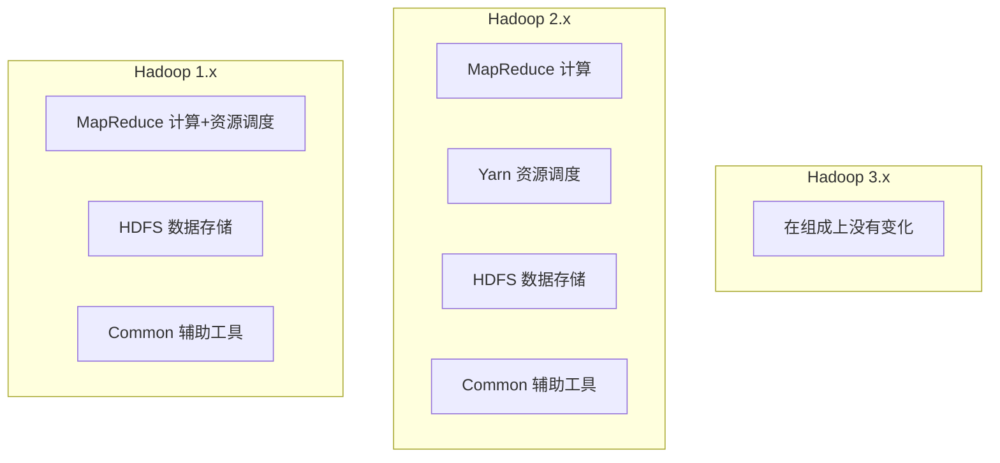
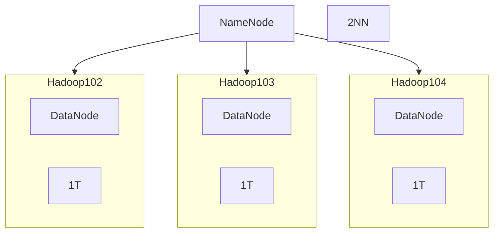
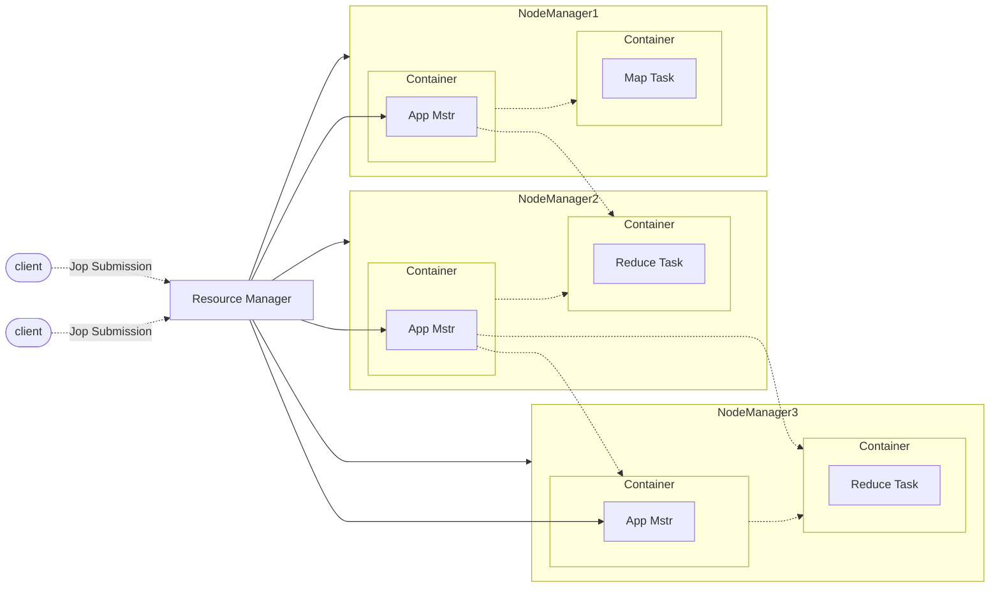
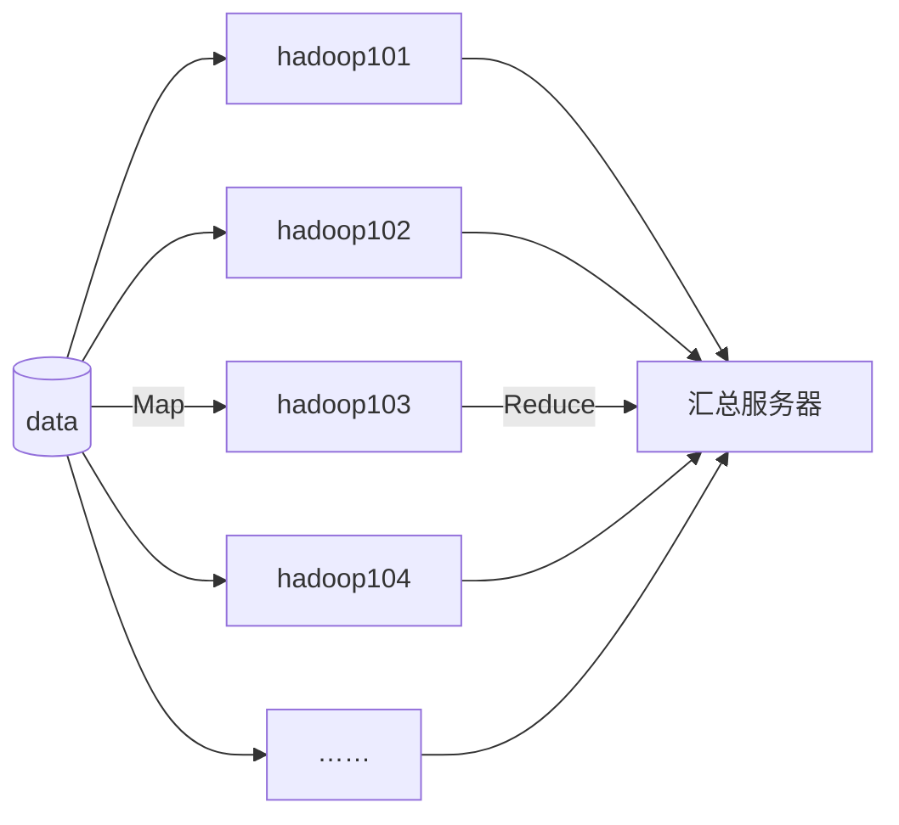
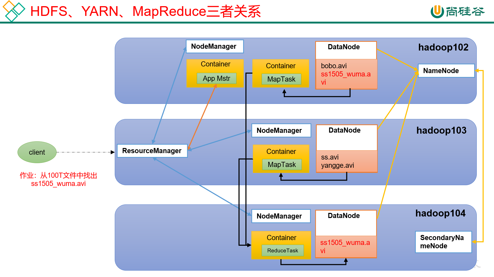

[TOC]

# Hadoop组成

Hadoop 1.x 2.x 3.x区别

## HDFS架构概述

HDFS：Hadoop Distributed File System，是一个分布式文件系统

NameNode（nn）：存储文件的原数据，如文件名、目录结构、文件属性（生成时间、副本数、文件权限等），以及每个文件的块列表和块所在的DataNode等。

DataNode（dn）：在本地文件系统存储文件块数据，以及块数据的校验和。

Seconda NameNode（2nn）：每隔一段时间对NameNode原数据备份

## YARN架构概述

YARN：Yet Another Resource Negotiator ，另一种资源协调者，是Hadoop的资源管理器。

ResourceManeger(RM)：整个集群资源（内存、CPU等）的老大

NodeManager(NM)：单个节点服务器资源老大

ApplicationMaster(AM)：单个任务运行的老大

Container：容器，相当于一台独立的度武器，里面封装了内存任务所需的资源，如内存、CPU、磁盘、网络等

说明：

- 客户端可以有多个
- 集群上可以运行多个ApplicationMaster
- 每个NodeManager上可以有多个Container

## MapReduce架构概述

MapReduce将计算分为两个阶段：Map和Reduce

1. Map阶段并行处理输入数据
2. Reduce阶段对Map结果进行汇总

HDFS、YARN、MapReduce三者关系

