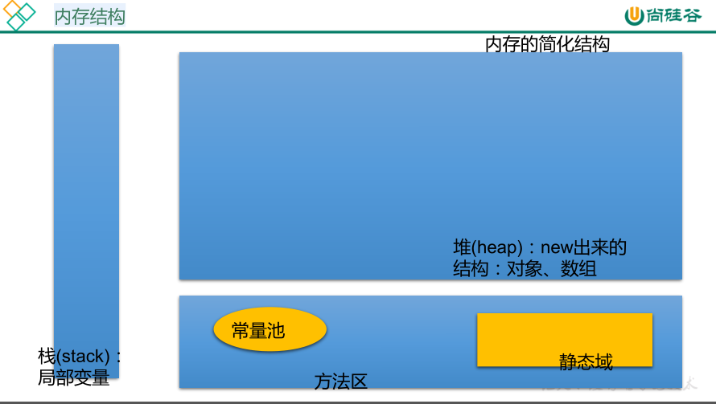
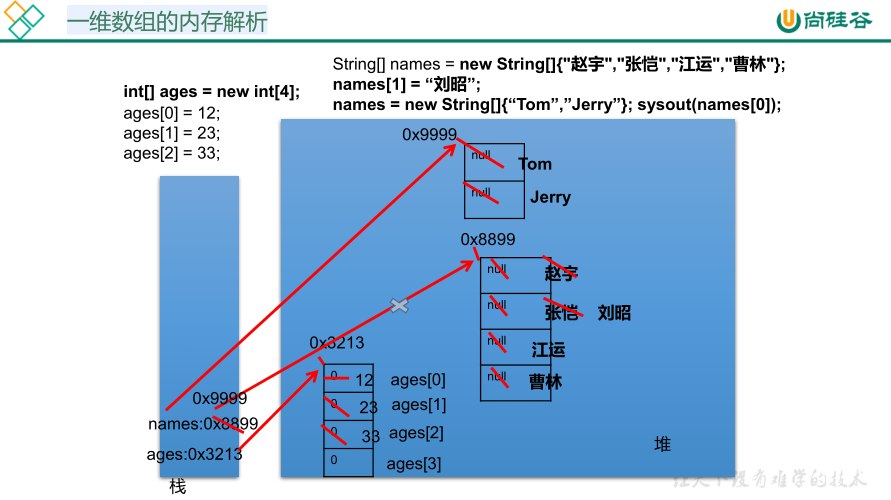

[TOC]

# 3.1 数组的概述

数组(Array)，是多个相同类型数据按一定顺序排列的集合，并使用一个名字命名，并通过编号的方式对这些数据进行统一管理。

数组本身是**引用数据类型**，而数组中的元素可以是**任何数据类型**，包括基本数据类型和引用数据类型。

数组的**长度一旦确定，就不能修改**。

# 3.2 一维数组的使用

## 一维数组的使用：声明

```java
type var[];
type[] var;

//例如：
int a[];
int[] a1;
String[] c;
```

Java中**声明**数组时不能指定其长度（数组中元素的数），例如：`int a[5]`

## 一维数组的使用：初始化

动态初始化：数组声明且为数组元素分配空间与赋值的操作分开进行

```java
int[] arr = new int[3];
arr[0] = 3;
arr[1] = 9;
arr[2] = 8;

String names[];
names = new String[3];
names[0] = "钱学森";
names[1] = "邓稼先";
names[3] = "袁隆平"；
```

静态初始化：数组声明且为数组元素分配空间与赋值的操作分开进行

```java
int arr[] = new int[]{1,2,3}; 或 int[] arr = {2,5,7};
String names[] = {"李四光", "茅以升", "华罗庚"};
```

## 一维数组的使用：引用

定义并用运算符new为之分配空间后，才可以引用数组中的每个元素。

数组元素的饮用方式：数组名[元素下标]

## 一维数组的使用：数组元素的默认初始化

数组是引用类型，它的元素相当于类的成员变量，因此数组一经分配空间，其中的每个元素也被按照成员变量同样的方式被隐式初始化。

```java
public class T est {
    public static void main(String argv[]){
        int a[]= new int[5];
        System.out.println(a[3]); //a[3]的默认值为0
    }
}
```

| 数组元素类型     | 元素默认初始值 |
| ---------------- | -------------- |
| byte, short, int | 0              |
| long             | 0L             |
| float            | 0.0F           |
| double           | 0.0            |
| char             | 0 或 ‘\u0000’  |
| boolean          | false          |
| 引用类型         | null           |

```java
public class Test{
    public static void main(String args[]){
        int[] s;
        s = new int [10];
        for (int i = 0; i<10; i++){
            s[i] = 2*i+1;
            System.out.println(s[i]);
        }
    }
}
```





# 3.3 多维数组的使用

## 多维数组的使用：初始化

动态初始化

```java
int[][] arr = new int[3][2];
int[][] arr = new int[3][];  //int[][]arr = int[][3]; //非法 
```

静态初始化

```java
int[][] arr = new int[][]{{3,8,2},{2,7},{9,0,1,5}};
```

特殊写法

```java
int[] x; //一维数组
int[] y[]; //二维数组
```

# 3.5 Arrays工具类的使用

java.util.Arrays类即为操作数组的工具类，包含了用来操作数组（比如排序和搜索）的各种方法。

| 方法名                            | 功能                                   |
| --------------------------------- | -------------------------------------- |
| boolean equals(int[] a,int[] b)   | 判断两个数组是否相等。                 |
| String toString(int[] a)          | 输出数组信息。                         |
| void fill(int[] a,int val)        | 将指定值填充到数组之中。               |
| void sort(int[] a)                | 对数组进行排序。                       |
| int binarySearch(int[] a,int key) | 对排序后的数组进行二分法检索指定的值。 |

