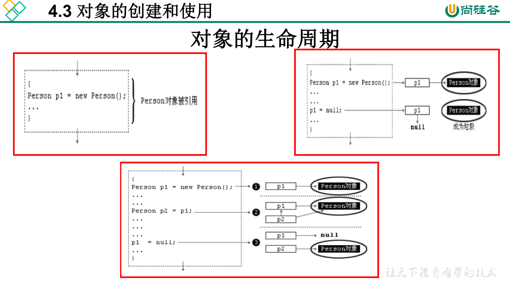
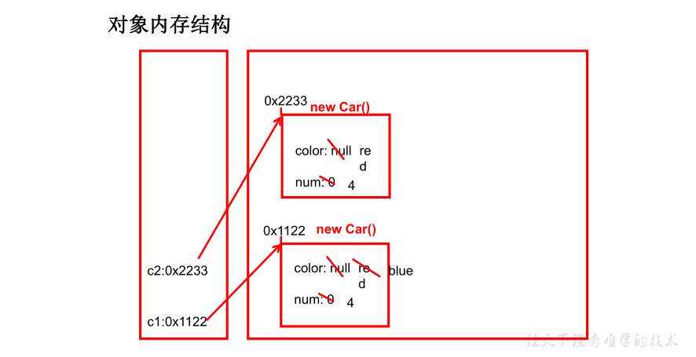
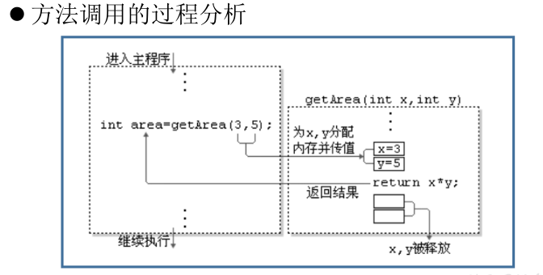
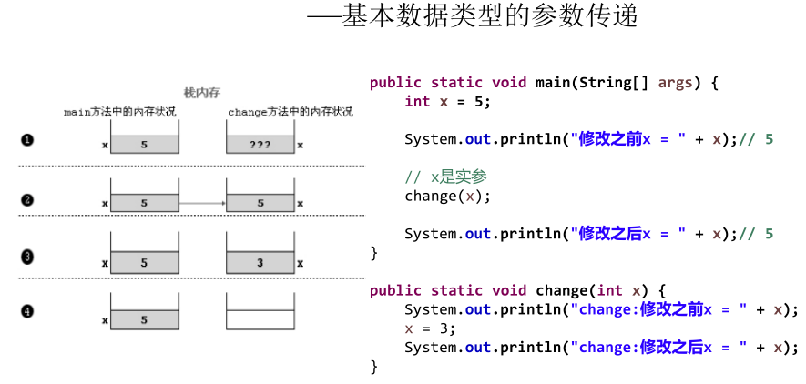
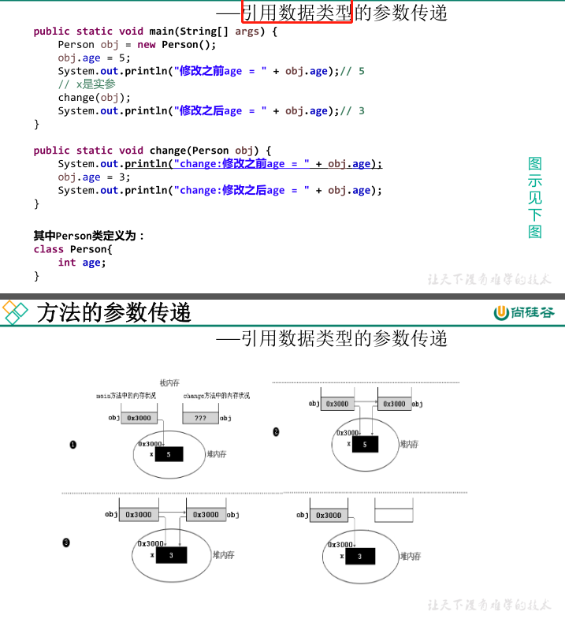

学习面向对象内容的三条主线

1. Java类及类的成员
2. 面向对象的三大特征
3. 其他关键字

[TOC]


# 4.1 面向过程与面向对象

- 面向过程（POP）：强调功能行为，以函数为最小单位，考虑怎么做。
- 面向对象（OOP）：将功能封装进对象，强调具备了功能的对象，以类/对象为最小单位，考虑谁来做。
- 面向对象更加强调运用人类在日常的思维逻辑中采用的思想方法与原则，如抽象、分类、继承、聚合、多态等。

## 面向对象的三大特征

- 封装 (Encapsulation)
- 继承 (Inheritance)
- 多态 (Polymorphism)

## 面向对象分析方法分析问题的思路和步骤

1. 根据问题需要，选择问题所针对的现实世界中的实体。
2. 从实体中寻找解决问题相关的属性和功能，这些属性和功能就形成了概念世界中的类
3. 把抽象的实体用计算机语言进行描述，形成计算机世界中类的定义。即借助某种程序语言，把类构造成计算机能够识别和处理的数据结构。
4. 将类实例化成计算机世界中的对象。对象是计算机世界中解决问题的最终工具。

# 4.2 Java基本元素：类和对象

**类(Class)**和**对象(Object)**是面向对象的核心概念。

- 类是对一类事物的描述，是抽象的、概念上的定义
- 对象是实际存在的该类事物的每个个体，因而也称为**实例(instance)**。

面向对象程序设计的重点是**类的设计**，其实就是**类的成员的设计**

常见的类的成员有

- 属 性（Field）：对应类中的成员变量
- 行 为（Method）：对应类中的成员方法

类的语法格式

```java
修饰符 class 类名{
    属性声明;
    方法声明;
}

//例子
public class Person{
    private int age;	//声明私有变量age
    public void showAge(int i){	//声明方法showAge
        age = i;
    }
}
```

创建Java自定义类

1. 自定义类（考虑修饰符、类名）
2. 编写类的属性（考虑修饰符、属性类型、属性名、初始化值）
3. 编写类的方法（考虑修饰符、返回值类型、方法名、形参等）

# 4.3 对象的创建和使用

## 创建对象语法

```java
类名 对象名 = new 类名();
```

使用“对象名.对象成员”的方式访问对象成员（包括属性和方法）

```java
public class Animal{
    public int legs;
    public void eat(){
        System.out.println("Eating.");
    }
    public void move(){
        System.out.println("Move.")
    }
}
public class Zoo{
    public static void main (String args[]){
        //创建对象
        Animal xb = new Animal();
        xb.legs = 4; //访问属性
        System.out.println(xb.legs);
        xb.eat(); //访问方法
        xb.move(); //访问方法
    }
}
```

在一个类中的访问机制： 类中的方法可以直接访问类中的成员变量 。（ 例外：static 方法访问非static ， 编译不通过 。 ）

在不同类中的访问机制： 先创建要访问类的对象 ， 再用对象访问类中定义的成员 。



## 内存解析

- 堆（Heap）：此内存区域的唯一目的就是存放对象实例，几乎所有的对象实例都在这里分配内存。这一点在Java虚拟机规范中的描述是：所有的对象实例以及数组都要在堆上分配。

- 栈（Stack）：是指虚拟机栈。虚拟机栈用于存储局部变量等。局部变量表存放了编译期可知长度的各种基本数据类型（boolean、byte、char 、 short 、 int 、 float 、 long 、double）、对象引用（reference类型，它不等同于对象本身，是对象在堆内存的首地址）。 方法执行完，自动释放。

- 方法区（Method Area）：用于存储已被虚拟机加载的类信息、常量、静态变量、即时编译器编译后的代码等数据。

- ```java
  class Car{
      String color = "red";
      int num = 4;
      void show(){
          	System.out.println("color="+color+"..num="+num);
          }
      }
  class CarTest {
      public static void main(String[] args) {
          Car c1 = new Car(); // 建立对象c1
          Car c2 = new Car(); // 建立对象c2
          c1.color = "blue"; // 对对象的属性进行修改
          c1.show(); // 使用对象的方法
          c2.show();
      }  
  }
  ```

- 

## 匿名对象

- 我们也可以不定义对象的句柄，而直接调用这个对象的方法。这样的对象叫做匿名对象。例如：new Person().shout(); 
- 使用情况
  - 如果对一个对象只需要进行一次方法调用，那么就可以使用匿名对象。
  - 我们经常将匿名对象作为实参传递给一个方法调用。

# 4.4 类的成员之一：属性

## 属性的声明格式

```java
修饰符 数据类型 属性名 = 初始化值;
```

## 修饰符	

- 常用的修饰符有：private、缺省、protected、public

- 其他修饰符：static、final

## 数据类型

- 任何基本数据类型或任何引用数据类型

## 属性名

- 属于标识符，符合命名规则和规范即可

```java
//例子
public class Person{
    private int age; //声明private变量 age
    public String name = "Lila"; //声明public变量name;
}
```

## 变量的分类：成员变量与局部变量

- 在方法体外，类体内声明的变量称为成员变量
- 在方法体内部声明的变量称为局部变量


注意：

- 二者都有生命周期
- 局部变量除形参外，均需显式初始化

成员变量和局部变量的区别

|              | 成员变量                    | 局部变量                               |
| ------------ | --------------------------- | -------------------------------------- |
| 声明的位置   | 直接声明在类中              | 方法形参或内部、代码块内、构造器内     |
| 修饰符       | private\public\static\final | 不能用权限修饰符修饰，可以用final修饰  |
| 初始化值     | 有默认初始化值              | 没有默认初始化值，必须显示赋值方可使用 |
| 内存加载位置 | 堆空间或静态域内            | 栈空间                                 |

```java
class Person{ //人类
    // 1.属性
    String name; //姓名
    int age = 1; //年龄
    boolean isMale; //是否为男性
    public void show(String nation){ //nation局部变量
        String color; //color变量
        color = "yellow";
    }
}
//测试类
class PersonTest{
    public static void main(String[] args){
        Person p = new Person();
        p.show("USA");
    }
}
```

对象属性的默认初始化值：当一个对象被创建时，会对其中各种类型的成员变量自动进行初始化赋值。除了基本数据类型之外的变量类型都是引用类型。

# 4.5 类的成员之二：方法

## 方法(method 、函数)

- 方法是类或对象行为特征的抽象，用来完成某个功能操作。在某些语言中也称为函数或过程。
- 将功能封装为方法的目的是，可以实现代码重用，简化代码
- Java里的方法不能独立存在，所有的方法必须定义在类里。

## 方法的声明格式

```jaba
修饰符 返回值类型 方法名（参数类型 形参1, 参数类型 形参2, ...）{
	方法体程序块
	return 返回值;
}
```

修饰符：public，缺省，private，protected等

方法名：属于标识符，命名时遵循标识符命名规则和规范，“ 见名知意”

形参列表：可以包含零个，一个或多个参数。多个参数时，中间用“, ”隔开

返回 值：方法在执行完毕后返还给调用它的程序的数据。

```java
public class Person{
    private int age;
    public int getAge(){ //声明方法
        return age;
    }
    public void setAge(int i){
        age = i;
    }
}
```

## 方法的调用

方法通过方法名被调用，且只有被调用才会被执行



- 方法被调用一次，就会执行一次
- 没有具体返回值的情况，返回值类型用关键字void表示，那么方法体中可以不必使用return语句。如果使用，仅用来结束方法。
- 定义方法时，方法的结果应该返回给调用者，交由调用者处理。
- 方法中只能调用方法或属性，不可以在方法内部定义方法。

# 4.6 再谈方法

## 方法的重载

在同一个类中，允许存在一个以上的同名方法，只要它们的参数个数或者参数类型不同即可。使用重载方法，可以为编程带来方便。

特点

与返回值类型无关，只看参数列表，且参数列表必须不同。(参数个数或参数类型)。调用时，根据方法参数列表的不同来区别。

```java
//System.out.println()方法就是典型的重载方法，其内部的声明形式如下
public void println(byte x)
public void println(short x)
public void println(int x)
public void println(long x)
public void println(float x)
public void println(double x)
public void println(char x)
public void println(double x)
public void println()
```


## 可变形参的方法

声明格式

```java
方法名（参数的类型名... 参数名）
```

JavaSE 5.0 中提供了Varargs(variable number of arguments)机制，允许直接定义能和多个实参相匹配的形参。从而，可以用一种更简单的方式，来传递个数可变的实参。

- 可变个数形参的方法与同名的方法之间，彼此构成重载
- 可变参数方法的使用与方法参数部分使用数组是一致的
- 方法的参数部分有可变形参，需要放在形参声明的最后
- 在一个方法的形参位置，最多只能声明一个可变个数形参


## 方法参数的值传递机制

方法必须由其所在类或对象调用才有意义。

Java的实参值如何传入方法：值传递。 即将实际参数值的副本（复制品）传入方法内，而参数本身不受影响。

- 形参是基本数据类型：将实参基本数据类型变量的“数据值”传递给形参
  
- 形参是引用数据类型：将实参引用数据类型变量的“地址值”传递给形参
  

## 递归方法(Recursion) 

递归方法：一个方法体内调用它自身。

方法递归包含了一种隐式的循环，它会重复执行某段代码，但这种重复执行无须循环控制。

递归一定要向已知方向递归，否则这种递归就变成了无穷递归，类似于死循环。

```java
//计算1-100之间所有自然数的和
public int sum(int num){
    if(num == 1){
        retuen 1;
    }else{
        return num+sum(num - 1);
    }
}
```

# 4.7 OOP特征之一：封装与隐藏

程序设计追求“高内聚，低耦合”

- 高内聚 ：类的内部数据操作细节自己完成，不允许外部干涉；
- 低耦合 ：仅对外暴露少量的方法用于使用。

Java中通过将数据声明为私有的(private)，再提供公共的（public）方法

- 隐藏一个类中不需要对外提供的实现细节；
- 使用者只能通过事先定制好的方法来访问数据，可以方便地加入控制逻辑，限制对属性的不合理操作；
- 便于修改，增强代码的可维护性；

| 修饰符    | 类内部 | 同一个包 | 不同包的子类 | 同一个工程 |
| --------- | ------ | -------- | ------------ | ---------- |
| private   | √      |          |              |            |
| 缺省      | √      | √        |              |            |
| protected | √      | √        | √            |            |
| public    | √      | √        | √            | √          |

# 4.8 类的成员之三：构造器

## 构造器的声明格式

```java
修饰符  类名 ( 参数列表) {
	初始化 语句；
}
```

## 构造器的特征

- 它具有与类相同的名称
- 它不声明返回值类型。（与声明为void不同）
- 不能被static、final、synchronized、abstract、native修饰，不能有return语句返回值

```java
//例子
public class Animal {
    private int legs;
    // 构造器
    public Animal() {
    	legs = 4;
    } 
    public void setLegs(int i) {
    	legs = i;
    }
    public int getLegs() {
    	return legs;
    }
}
```

## 构造器的作用

创建对象；给对象进行初始化

# 4.9 关键字：this

# 4.10 关键字：package、import

