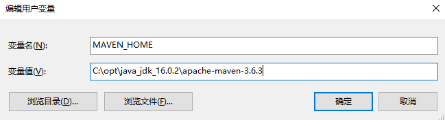

> 本文整理自尚硅谷_封捷

[toc]

# 目前开发中存在的问题

1. 一个项目就是一个工程。
   如果项目非常庞大，不适合用package管理项目（eclipse），最好是每一个模块对应一个工程，利于分工协作。
   借助Maven就可以将一个项目拆分成工程。
2. 项目中的jar包必须手动“复制”、“粘贴”粘贴到WEB-INF/lib目录下。
   带来的问题是：同样的jar包重复出现在不同的项目工程中，一方面浪费时间，另外也让工程比较臃肿。
   借助Maven，可以将jar包仅仅保存在“仓库”中，有需要使用的工程“引用”这个文件接口，并不需要真的把jar包复制过来
3. jar包需要别人替我们准备好，或到官网下载。
   不同技术的官网提供jar包下载的形式五花八门。
   有些技术的官网就是通过Maven或SVN等专门的工具来提供下载的。
   借助于Maven可以以一种规范的方式下载jar包。因为所有知名框架或第三方工具的jar包以及按照统一的规范存放在了Maven的中央仓库中。
4. 一个jar包依赖的其他jar包需要自己手动加到项目中。

# Maven是什么

1. Maven是一款服务于Java平台的自动化工具构建工具
   Make->Ant->Maven->Gradle
   
2. 构建
   1. 以“Java源文件“、”框架配置文件“、”JSP“、”HTML“等资源为”原材料“，去”生产“一个可以运行的项目的过程。
      - 编译
      - 部署
      - 搭建
   2. 编译：Java源文件[User.java]->编译->Classs字节码文件[User.class]->交给JVM执行
   3. 部署：一个BS项目最终运行的并不是动态Web工程本身，而是这个动态Web工程“编译的结果”
   
3. 构建过程中的各个环节
   1. 清理clean：将以前编译得到的旧文件class字节码文件删除
   2. 编译compile：将java源程序编译成class字节码文件
   3. 测试test：自动测试，自动调用junit程序
   4. 报告report：测试程序执行的结果
   5. 打包package：动态Web工程打War包，java工程打jar包
   6. 安装install：Maven特定的概念——将打包得到的文件复制到“仓库”中的指定位置
   7. 部署deploy：将动态Web工程生成的war包复制到Servlet容器下，使其可以运行
   
   ```mermaid
   flowchart LR
   a1[清理 clean]
   a2[编译 compile]
   a3[测试 test]
   a4[报告]
   a5[打包 package]
   a6[部署 deploy]
   a1-->a2-->a3-->a4-->a5-->a6
   ```

# 安装Maven核心程序

## 下载Maven核心程序

检查JAVA_HOME环境变量。Maven本身是用Java写的，所以要求必须安装JDK。

```bash
C:\Users\Wang>ECHO %JAVA_HOME%
C:\opt\java_jdk_16.0.2\install
```

Maven官网 https://maven.apache.org/download.cgi。下载并解压Maven安装程序，推荐放在【非中文无空格】目录下。

## 配置Maven环境变量



| 变量            | 路径                      |
| --------------- | ------------------------- |
| 新建 MAVEN_HOME | X:\xxx\apache-maven-3.6.3 |
| 增添 Path       | %MAVEN_HOME%\bin          |

## 验证是否安装成功

运行`mvn -v`命令

```bash
C:\Users\Wang>mvn -v
Apache Maven 3.6.3 (cecedd343xxxxxxxxxxb50b32b541b8a6ba2883f)
Maven home: C:\opt\java_jdk_16.0.2\apache-maven-3.6.3\bin\..
Java version: 16.0.2, vendor: Oracle Corporation, runtime: C:\opt\java_jdk_16.0.2\install
Default locale: zh_CN, platform encoding: GBK
OS name: "windows 10", version: "10.0", arch: "amd64", family: "windows"
```


