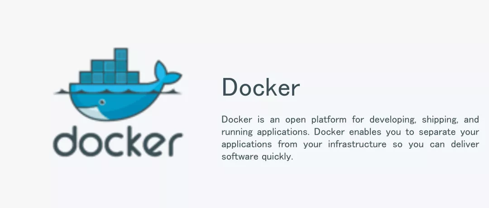

> 整理自 docker docs https://docs.docker.com/

# 什么是Docker？

——能在任何环境开发部署运行任何APP

Docker是一个用于开发、迁移及运行应用的开放平台。Docker可以让你更快地发布应用，使用 Docker你就可以分布地在你的设备上部署你的应用，并且管理你的设备就像管理一个应用程序一样。 Docker可以帮助你更快的迁移、测试、部署代码，以及能够缩短编写和运行代码的周期。

Docker提供了一种能在一个容器中安全独立地运行几乎任何应用的方式。在安全独立的同时，可以让你在你的主机上同时运行多个容器。

Docker有以下两个重要的组件：

- Docker：开源的容器虚拟化平台
- Docker Hub：分享和管理的Saas平台

## Docker的体系结构是什么？

Docker使用的是C-S( client-server)架构。

### Docker守护进程( The Docker daemon )

如上图所示，Docker守护进程运行在一主机上，用户不直接与守护进程交互，而是通过Docker客户端。

### Docker客户端( The Docker client )

Docker客户端是以Docker的二进制形式，是Docker主要的用户界面。用户使用命令行来与Docker 守护进程沟通。

### Docker内部( Inside Docker ) 

Docker images：docker镜像，是一个只读的模板。

Docker registries：docker寄存器，存放着Docker镜像，这就是一个公共的和私有的仓库，你可以上传和下载镜像。

Docker containers：docker容器。

