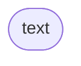
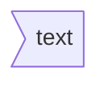

**Mermaid流程图**

[TOC]

最近发现typora可以画流程图，能代替代对幕布的一部分使用需求。typora这里是用`mermaid`语法控制作图，除了流程图，`mermaid`还支持甘特图、类图、饼图等。

看了两篇`mermaid`教程，觉得可以综合出一篇更全的，于是就有了第三篇教程/笑。

Typora v0.11.8 

Memaid v8.8.3

# Mermaid介绍

Mermaid 是一个基于 Javascript 的图表和图表工具，它基于 markdown 语法来简化和加速生成流程图的过程，也不止于生成流程图。

# 图形

头部用`graph`或`flowchart`关键字来声明流程图。两者用法基本一致，使用`graph`声明时，链接线上的文字会附带白底；使用`flowchart`声明时，连接线更平滑，并且似乎可以支持更新的语法。更多区别详见源码，以下内容不加区分地使用两种声明方式。

```
graph TD
  A[Christmas] -->|Get money| B(Go shopping)
  B --> C{Let me think}
  C -->|One| D[Laptop]
  C -->|Two| E[iPhone]
  C -->|Three| F[fa:fa-car Car]
```


## 一个节点（默认）

```
graph LR 
id
```


## 带有文字的节点

```
graph LR
id[文字]
```


# 流程图方向

| 方向     | 代码  |
| -------- | ----- |
| 从上到下 | TB/TD |
| 从下到上 | BT    |
| 从左到右 | LR    |
| 从右到左 | RL    |

```
graph TB
start --> stop
```


```
graph LR
start --> stop
```


# 节点样式

## 矩形

```
id[text]
```


## 圆角矩形

```
id(text)
```


## 体育场形

```
id([text])
```



## 子程序形

```
id[[text]]
```


## 圆柱形

```
id[(text)]
```


## 圆形

```
id((text))
```


## 不对称矩形

```
id>text]
```



## 菱形

```
id{text}
```


## 六边形

```
id{{text}}
```


## 平行四边形

```
id1[/text/]
id2[\text\]
```


## 梯形

```
id[/text\]
```


## 含特殊字符

含有`()` `[]` `{}`等特殊字符时，可用双引号`""`包裹处理。

```
id["[特殊字符]"]
```

## 小结


# 节点之间的连接

## 连接线样式

| 连接线样式 | 命令 |
| ---------- | ---- |
| 实线       | ---  |
| 虚线       | -.-  |
| 加粗实线   | ===  |

```
a---b
a-.-b
a===b
```


## 箭头样式

| 箭头样式 | 命令                     |
| -------- | ------------------------ |
| 右键头   | -->                      |
| 圆形箭头 | --o                      |
| 叉形箭头 | --x                      |
| 双向箭头 | <--><br />o--o<br />x--x |

```
a --> b
a --ob 
a --x b
a <--> b
a o--o b
```


## 连接上的文本

```
a-->|text|b
```


## 连接长度

```
a1---a2
b1----b2
a---->b
```

```mermaid
graph LR
a1---a2
b1----b2
a---->b
```

## 小结

| 长度              | 1    | 2     | 3      |
| ----------------- | ---- | ----- | ------ |
| Normal            | ---  | ----  | -----  |
| Normal with arrow | -->  | --->  | ---->  |
| Thick             | ==   | ===   | =====  |
| Thick with arrow  | ==>  | ===>  | ====>  |
| Dotted            | -.-  | -..-  | -...-  |
| Dotted with arrow | -.-  | -..-> | -...-> |

## 链式连接

```
a --- b1 & b2--- c
```

```mermaid
graph LR
a --- b1 & b2--- c
```

```
a1 & a2 --- b1 & b2 & b3
```

```mermaid
graph TB
a1 & a2 --> b1 & b2 & b3
```

## 示例

```
graph TD
    A[Start] --> B{Is it?} -->|Yes| C[OK];
    C --> D[Rethink];
    D --> B;
    B ---->|No| E[End];
```

```mermaid
graph TD
    A[Start] --> B{Is it?}-->|Yes| C[OK];
    C --> D[Rethink];
    D --> B;
    B ---->|No| E[End];
```

# 节点上的超链接

可以将单击事件绑定到节点，单击可以使 javascript 回调或将在新浏览器选项卡中打开链接。

```
graph LR;
    A-->B;
    B-->C;
    click A "http://www.github.com" _blank
    click B "http://www.github.com" "Open this in a new tab" _blank
```

```mermaid
graph LR;
    A-->B;
    B-->C;
    click A "http://www.github.com" _blank
    click B "http://www.github.com" "Open this in a new tab" _blank
```

typora对`Interaction`支持有限，更多内容可以查看mermaid官方文档。

# 子图

```
graph TB
    subgraph one
    a1-->a2
    	subgraph subone
    	a11-->a21
    	end
    end
    subgraph two
    b1-->b2
    end
    subgraph three
    c1-->c2
    end
	c1-->a2
	one-->two
```

```mermaid
graph TB
    subgraph one
    a1-->a2
    	subgraph subone
    	a11-->a21
    	end
    end
    subgraph two
    b1-->b2
    end
    subgraph three
    c1-->c2
    end
	c1-->a2
```

测试功能：子图连接

当图像类型选择`flowchart`时，可以设置子图之间的边的连接。

注：在当前版本，此处仅支持使用`flowchart`声明。

```
%% Bata:With the graphtype flowcharts it is also 	possible to set edges to and from subgraphs as in the flowchart below.

flowchart TB
	    c1-->a2
    subgraph one
    a1-->a2
    end
    subgraph two
    b1-->b2
    end
    subgraph three
    c1-->c2
    end
    one --> two
    three --> two
    two --> c2
```

```mermaid
%% Bata:With the graphtype flowcharts it is also 	possible to set edges to and from subgraphs as in the flowchart below.

flowchart TB
	    c1-->a2
    subgraph one
    a1-->a2
    end
    subgraph two
    b1-->b2
    end
    subgraph three
    c1-->c2
    end
    one --> two
    three --> two
    two --> c2
```

子图的方向

当前版本暂不支持

```
flowchart LR
  subgraph TOP
    direction TB
    subgraph B1
        direction RL
        i1 -->f1
    end
    subgraph B2
        direction BT
        i2 -->f2
    end
  end
  A --> TOP --> B
  B1 --> B2
```

# 注释

注释以`%%`开头并且独占一行

```
graph LR
%% this is a comment A -- text --> B{node}
   A -- text --> B -- text2 --> C
```

```mermaid
graph LR
%% this is a comment A -- text --> B{node}
   A -- text --> B -- text2 --> C
```

# 节点样式

可以对节点应用特定样式，例如较粗的边框或不同的背景颜色。 

```
graph LR
    id1(Start)-->id2(Stop)
    style id1 fill:#f9f,stroke:#333,stroke-width:4px
    style id2 fill:#bbf,stroke:#f66,stroke-width:2px,color:#fff,stroke-dasharray: 5 5
```

```mermaid
graph LR
    id1(Start)-->id2(Stop)
    style id1 fill:#f9f,stroke:#333,stroke-width:4px
    style id2 fill:#bbf,stroke:#f66,stroke-width:2px,color:#fff,stroke-dasharray: 5 5
```

更多样式参考可以mermaid官方文档。


# 附录：相关链接

- 项目地址: [github.com/mermaid-js/…](https://github.com/mermaid-js/mermaid)
- 官方文档: [mermaid-js.github.io/mermaid/#/f…](https://mermaid-js.github.io/mermaid/#/flowchart)
- 在线编辑: [mermaidjs.github.io/mermaid-liv…](https://mermaidjs.github.io/mermaid-live-editor/)

