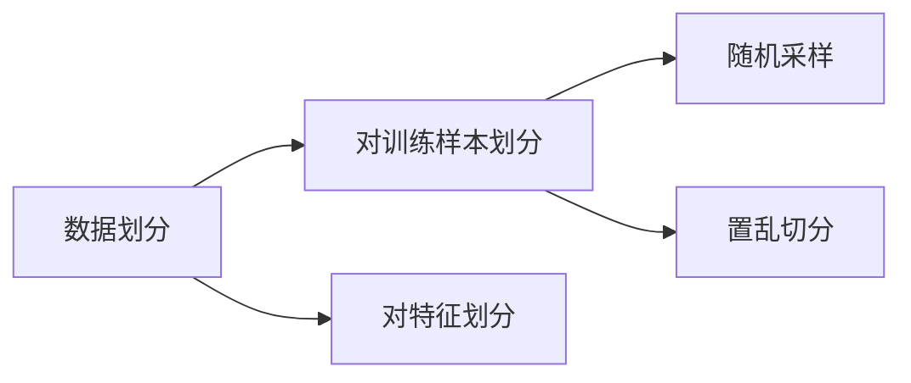
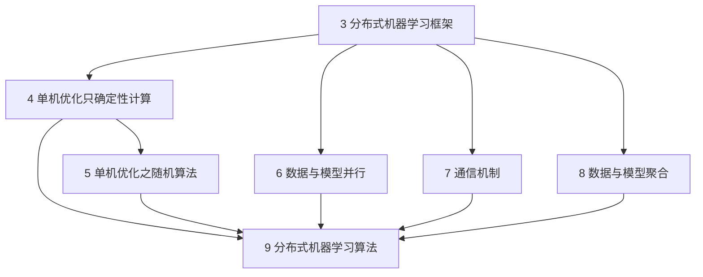

[toc]

# 3.1 大数据与大模型的挑战

# 3.2 分布式机器学习的基本流程

研究的主要问题

- 如何划分训练数据
- 如何分配训练任务
- 如何调配计算资源
- 如何整合分布式的训练结果

问题背景

- 计算量太大
- 训练数据太多
- 模型规模太大

一般而言，模型并行对通信的要求较高，上述三种分布式机器学习的情形在实际中通常是掺杂在一起发生的。

# 3.3 数据与模型划分模块

骨架网络：给定一个神经网络，往往存在一个规模更小的网络可以达到与其类似的函数拟合效果，这个小网络称为骨架网络。

# 3.4 单机优化模块

除去各工作节点之间相互的通信以外，在每个工作节点自身的视野里，基本就是一个传统的淡季机器学习任务。既要掌握主流的单机优化方法，还要了解在分布式的环境下，这些单机算法的理论性质。

# 3.5 通信模块

单机优化模块利用局部数据求得了本地模型的更新以后，就会涉及多机、多线程协作的问题。

## 3.5.1 通信的内容

数据并行框架下，把子模型或者子模型的更新（如梯度）作为通信的内容。

模型并行框架下，各个工作节点之间存在着很强的相互依存关系。某个子模型可能是另外一个子模型的输入。

## 3.5.2 通信的拓扑结构

### 1 基于迭代式MapReduce/AllReduce的通信拓扑

MapReduce方法：Map操作完成数据分发和并行处理，Reduce操作完成数据的全局同步和聚合。

MR直接用于机器学习的缺点：

- 完全依赖硬盘I/O的数据交互方式对于迭代式的机器学习效率太低
- 在MapReduce范式下，计算过程的中间状态不能得到维持，使得反复迭代的机器学习过程无法高效衔接

迭代式MapReduce方法：

- 基于内存的实现，缩减了计算过程中的I/O代价
- 引入了永久性存储（persistent store）
- 抽象表达简单，但不够灵活
  - 运算节点和模型存储节点没有很好的逻辑隔离，只能支持同步的通信模型
  - 需要将已有的单机优化算法进行较大的改动，才能完全符合Map和Reduce的编程接口

应用较广泛的迭代式MR系统包括：Spark MLib、Vowpal Wabbit（VW）、Cloudera等

### 2 基于参数服务器的通信拓扑

参数服务器（parameter server）架构把工作节点和模型存储节点在逻辑上区分开来，因此可以更加灵活地支持各种不同的通信模式。

- 参数服务器将各个工作节点之间的交互过程隔离开来，取而代之的是工作节点与参数服务器之间的交互。
- 可以采用多个参数服务器来共同维护较大的模型。

影响力比较大的几个参数服务器系统服务器包括CMU的Parameter Server和Petuum，谷歌的DistBelief，以及微软的Multiverso

### 3 基于数据流的通信拓扑

计算被描述成为一个有向无环图，图中的每个节点进行数据处理或者计算，图中的每条边代表数据的流动。

典型的数据流系统中，每个节点通常有两个通信通道：

- 控制消息流。决定工作节点应该接收什么数据，接收的数据是否完整，自己所要做的计算是否完成，是否可以让下游节点继续计算等。
- 计算数据流。主要负责接收模型训练时所需要的数据、模型参数等，再经过工作节点内部的计算单元，产生输出数据，按需提供给下游的工作节点。

影响力比较大的基于数据流的系统是谷歌的TensorFlow

## 3.5.3 通信的步调

早期的分布式机器学习实践中，同步的通信方式被大量使用。

- 基于BSP的随机梯度下降法（BSP-SGD）
- 模型平均法
- ADMM
- 弹性平均随机梯度下降（EA-SGD）

同步通信方式的局限性：

- 各个工作节点的计算性能显著不同时，全局的计算速度会被那些比较慢的节点所拖累
- 当有些工作节点不能正常工作时，整个集群的计算都无法完成

异步通信：每个工作节点在完成一定量的本地模型训练之后不需要等待其他节点，而是直接将自己的阶段性训练成果推送到参数服务器上，继续进行本地的模型训练。

异步的通信又分为有锁和无锁两种

- 有锁的异步通信：各个工作节点可以异步地进行本地学习，但是当他们把局部信息写入全局模型时，会通过加锁来保证数据写入的完整性，但这样可能会限制系统在参数更新方面的吞吐量。
- 无锁的异步通信：工作节点将局部信息写入全局模型时，不保证数据的完整性，以换取更高的吞吐量。

基于异步通信的算法包括，异步随机梯度下降法（ASGD）、HoGWild！、Cyclades；对于延迟不太敏感的异步通信方法，如AdaptiveRevision和AdaDelay；从本质上补偿延迟的异步通信方法，如带有延迟补偿的异步随机梯度下降法（DC-ASGD）

## 3.5.4 通信的频率

通信越频繁，各个工作节点相互协调越好，训练效果越有保障，通信代价更高。

# 后续章节关系图

