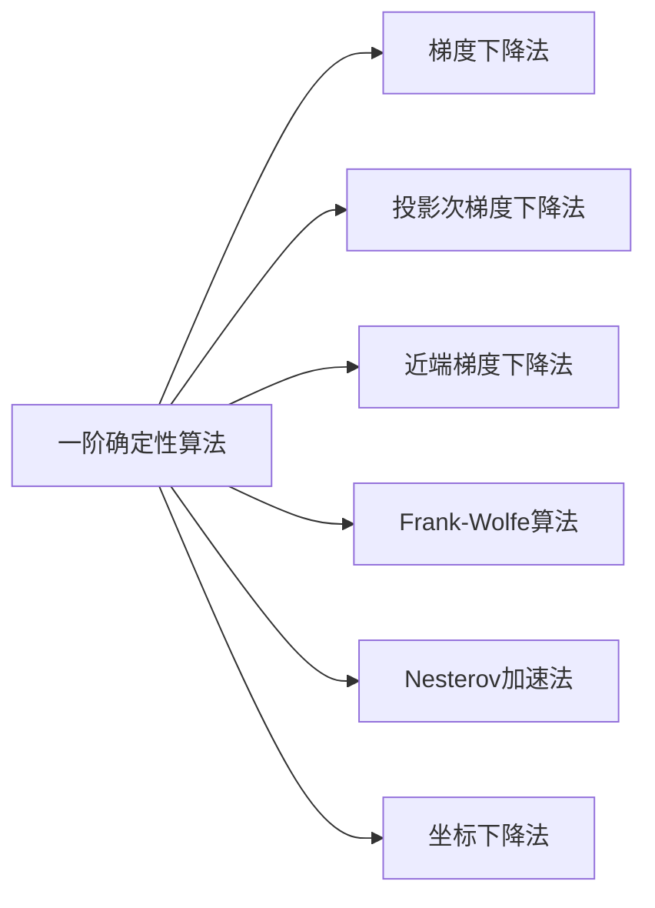
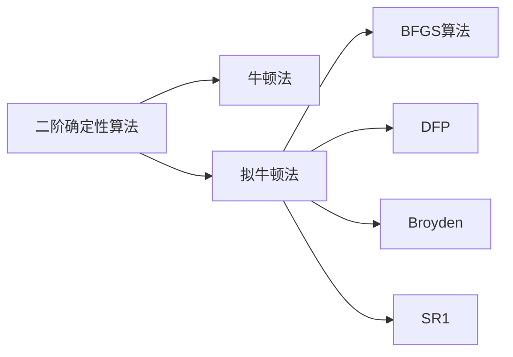

[TOC]

# 4.1 基本概述

## 4.1.1 机器学习的优化框架

### 1 正则化经验风险最小化

### 2 优化算法的收敛速度

### 3 假设条件

## 4.1.2 优化算法的分类和发展历史

是否对数据或者变量的维度进行了随机采样

- 确定性算法
- 随机算法

导数信息

- 一阶方法
- 二阶方法

优化算法

- 原始方法
- 对偶方法

# 4.2 一阶确定性算法

# 4.3 二阶确定性算法

# 4.4 对偶方法

# 4.5 总结

给定一个算法，对于不同凸性和光滑性质的目标函数，其收敛速度有所不同。通常来说，更好的凸性或者更好的光滑性质会加速算法的收敛。

- 一阶方法具有线性收敛速率，二阶方法具有二次收敛速率
- Nesterov加速法将梯度下降法速率中关于条件数的阶数进一步改进
- 投影次梯度法和Frank-Wolfe方法都可以用于解决带有约束的优化问题，两种方法的收敛速率相同，具体可以依据投影操作的难易程度来选择
- 一些拟牛顿法（比如BFGS）也可以和牛顿法一样达到二次收敛速率