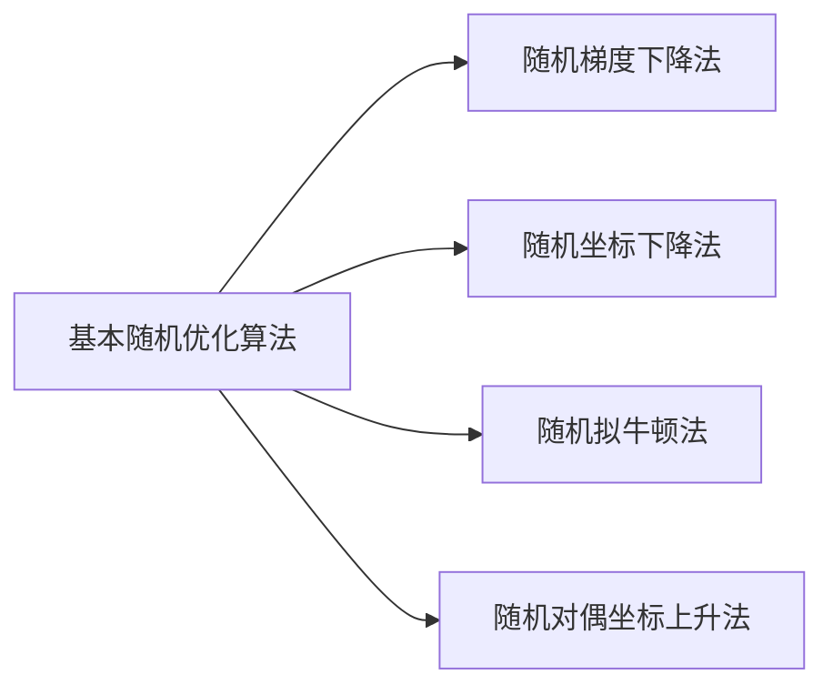
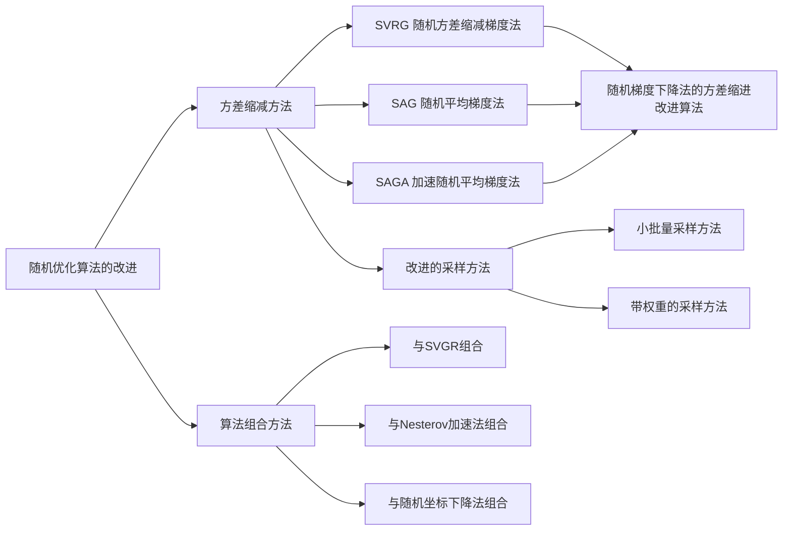
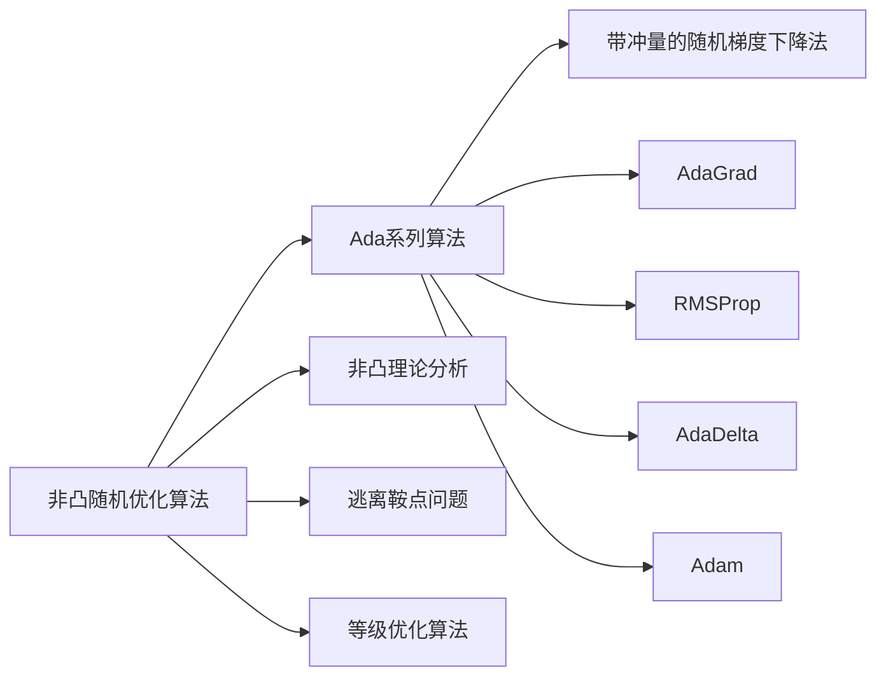

[TOC]

# 5.1 基本随机优化算法

# 5.2 随机优化算法的改进

# 5.3 非凸随机优化算法

## 5.3.1 Ada系列算法

## 3.5.2 非凸理论分析

1. Ghadimi和Lan证明了梯度随机下降法在非光滑条件下的计算复杂度为$O(n(\frac{L}{\epsilon}+\frac{L \sigma^2}{\epsilon^2}))$，与凸情况下相同。
2. Reddi和Sra等人证明了近端随机梯度下降法以及Frank-Wolfe算法再非凸条件下的收敛速率和凸情况下相同。
3. Li和Lin改进了加速近端梯度法（APG），在一些假设条件（如KL性质）下，证明了相应的APG算法在非凸情形的收敛速率为$O(\frac{1}{\sqrt{\epsilon}})$，与凸情形下一致，并且证明了Nesterov加速法在非凸条件下也能带来多项式阶的加速。
4. Reddi、Zhu、Hazan等人证明了SVRG的计算复杂度为$O(n+n^{\frac{2}{3}}(\frac{L}{\epsilon}))$，与凸情形下阶数相同。Zhu和Yuan还针对非凸问题设计了SVRG++算法，使得原始SVRG的内循环轮数递增，在非凸问题上取得了比SVRG更快的收敛速率。

## 3.5.3 逃离鞍点问题

1. Lee等人证明了随机梯度下降法在一定条件下可以依概率1收敛到局部极小值点。
2. Simon及其同事研究了梯度下降不能在多项式时间内逃离鞍点，至少需要$\exp(\Omega(d))$步。
3. Jim研究了扰动梯度下降算法，证明在多项式时间内可以收敛到局部极小值点。
4. Dauphin等人提出基于窒息区间的逃离鞍点算法，其中海森矩阵的计算以及特征值分解的计算代价较高，文中应用Krylov子空间算法来减小计算量。

## 3.5.4 等级优化算法

1. 通过局部磨光算子将目标函数转变为一个光滑函数，对应粗粒度版本的目标函数。
2. 用随机优化算法最小化这个光滑函数。
3. 将算法的解作为下一轮优化的起始点，减小磨光力度，返回步骤1。

