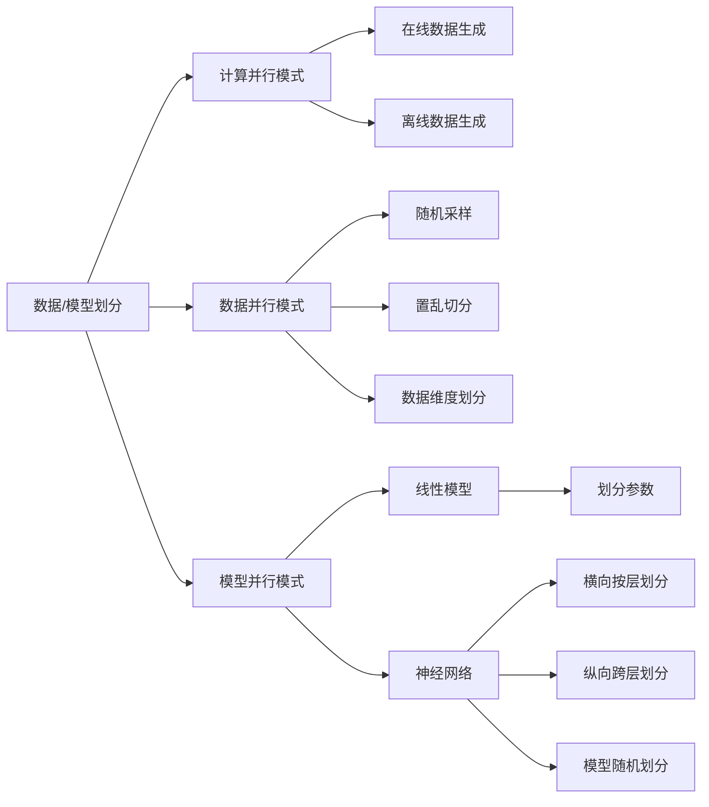
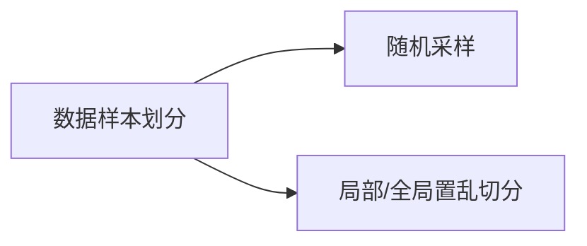
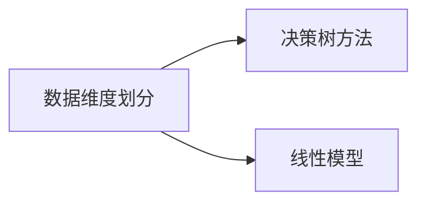
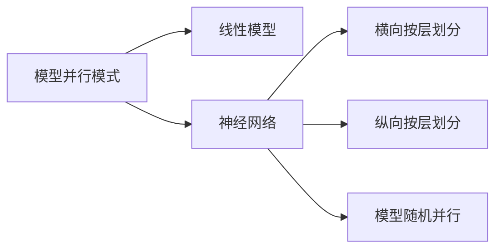
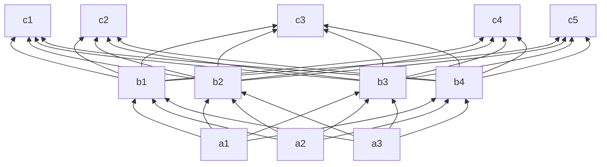
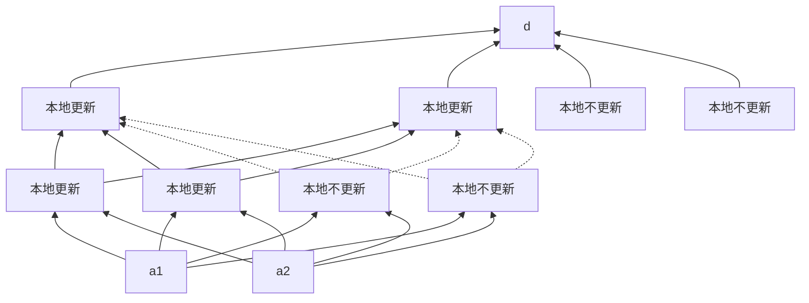
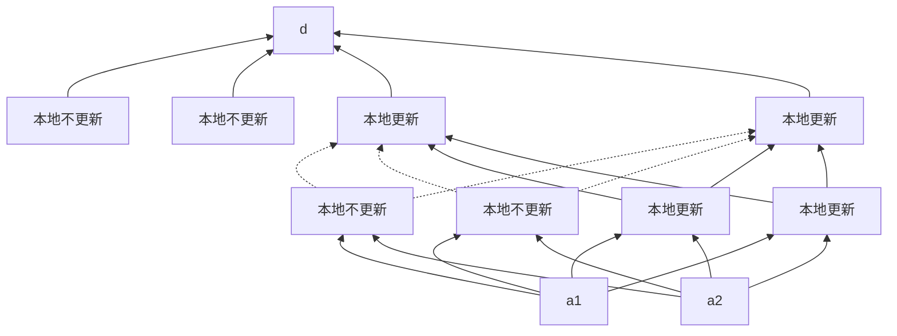

[TOC]

# 6.1 基本概述

# 6.2 计算并行模式

假设系统中的工作节点拥有共享内存（比如单机多线程环境），可以存储下数据和模型，并且每个工作节点对数据有完全的访问权限，对模型有读写权限。

假定数据有两种生成方式：

- 在线生成。工作节点读取的数据是即时地从真实的数据分布里生成的，数据的生成过程在优化算法结束的时候才停止。
- 离线生成。共享内存中的训练数据在开始执行前从真实的数据分布里生成，当算法开始执行之后，不再生成新的数据，工作节点需要样本时，通过随机采样使用这些数据中的某一个。

# 6.3 数据并行模式

如果工作节点有本地内存，但容量不足以存放下所有数据，此时，需要对数据进行划分，然后分配到各个工作节点。之后，各个工作节点使用本地数据对模型按照某种优化方法进行更新。

数据并行模式下的算法属于分布式算法。常见的数据划分方法有数据样本划分和数据维度划分。进行数据划分时要考虑以下两个因素：

- 数据量和数据维度与本地内存的相对大小。
- 优化方法的特点。

## 6.3.1 数据样本划分

机器学习中的目标函数，也就是训练数据集上的经验风险函数，关于样本是可分的，经验风险函数是所有训练样本对应的损失函数取值的加和。计算各个子集上的局部梯度值，再讲局部梯度加和，仍然可以得到整个经验风险函数的梯度。

实际工程实践中更多采用的是基于置乱切分的数据划分方法，有以下好处：

- 置乱切分复杂度比较低。
- 置乱切分数据信息量比较大。

## 6.3.2 数据维度划分

# 6.4 模型并行模式

涉及模型规模很大，不能存储到工作节点的本地内存，就需要对模型进行划分，然后各个工作节点负责本地局部模型的参数更新。

## 6.4.1 线性模型

对于线性模型而言，目标函数针对各个变量是可分的，某个维度的参数更新/梯度只依赖于一些与目标函数值有关的全局变量，而不依赖于其他维度的参数取值。

## 6.4.2 神经网络

神经网络有很强的非线性，参数之间的依赖关系比线性模型严重得多，不能进行简单的划分，也无法使用类似线性模型那样的技巧通过一个全局中间变量实现高效的模型并行。

### 1 横向按层划分

如果神经网络很深，一个自然并且易于实现的模型方法是将整个神经网络横向划分为K个部分，每个工作节点承担一层或几层的计算任务。

如果计算所需的信息本工作节点没有，则向相应的其他工作节点请求相关信息。模型横向划分的时候，通常会结合各层的节点数目，尽可能使得各个工作节点的计算量平衡。

假设多层神经网络G按照从输入到输出方向的顺序存储在K个工作节点上，相邻两个工作节点需要同时存储划分层的隐含节点。记K个子模型的存储信息为G1, G2, ..., Gk，其中$G_k=({Err}_k,G_k^0,{Act}_k)$，$Err_k$为子模型Gk的最底层节点的误差传播值，$Act_k$为子模型最顶层节点的激活函数值，$G_k^0$为除去底层误差传播值和顶层激活函数值之外的剩余激活函数值、误差传播值和子模型内各层连边权重。

- 前传过程：对于所有工作节点$k \ne 1$，需要在前传开始时，与存储Gk的下层邻接子模型$G_{k-1}$的工作节点k-1通信请求其最顶层的激活函数值$Act_{k-1}$。之后，工作节点前传激活函数值，直到计算得到子模型Gk的最顶层激活函数值$Act_k$。
- 后传过程：对于所有工作节点$k \ne K$，需要在后传开始的时候，与存储$G_k$的上层邻接子模型$G_{k+1}$的工作节点k+1通信请求最底层的误差传播值$Err_{k+1}$。之后，工作节点后传误差传播值，直到计算得到子模型Gk的最底层误差传播值$Err_k$。

虽然横向按层划分的算法逻辑简单，实现方便，但是工作节点之间需要互相等待借用相邻工作节点的信息来完成前传和后传。为了提高工作效率，我们可以考虑让 这些工作节点按照编号依次开始工作，形成流水线，这样每次迭代中的等待时间会减少。

### 2 纵向跨层划分

将每一层的隐含节点分配给不同的工作节点。工作节点存储并更新这些纵向子网络。在前传和后传过程中，如果需要子模型以外的激活函数值和误差传播值，向对应的工作节点请求相关信息并进行通信。

### 3 模型随机并行

骨架网络：给定一个神经网络，往往存在一个规模更小的网络可以达到与其类似的函数拟合效果，这个小网络称为骨架网络。

按照某种准则，在原网络中选出骨架网络，作为公用子网络存储每个工作节点。除骨架网络外，每个工作节点还会随机选取一些其他节点存储，以探索（exploration）骨架网络之外的信息。骨架网络周期性地依据新的网络重新选取。

文献表明：

- 模型随机并行的速度比纵向跨层划分快，尤其对于复杂任务下的大模型更是如此；
- 选取适当的骨架模型比例会使并行速度进一步提高。
