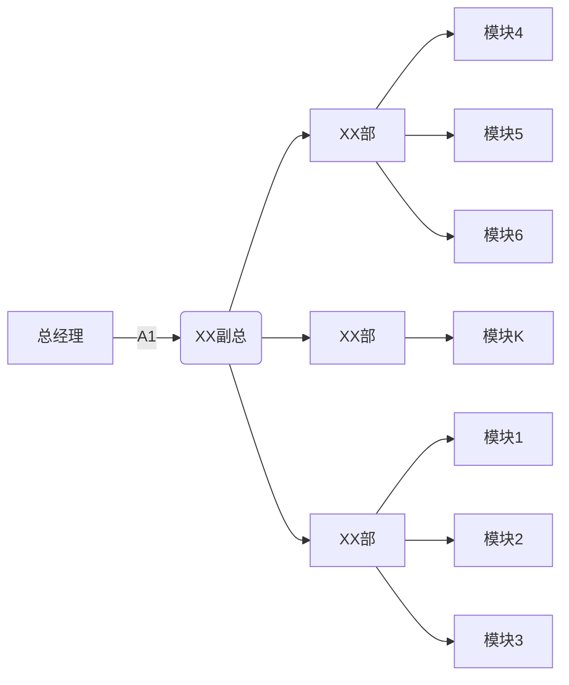

# Deep Learning in Neural Networks: An Overview

**Juergen Schmidhuber**

> https://arxiv.org/abs/1404.7828

生词

|                             |      |
| --------------------------- | ---- |
| Representation learning     |      |
| pixel                       |      |
| knobs                       |      |
| elaborate                   |      |
| distort                     |      |
| rectangular                 |      |
| intricate                   |      |
| respect to                  |      |
| infeasible                  |      |
| advent                      |      |
| speech recognition          |      |
| adjacent                    |      |
| motif                       |      |
| semantically                |      |
| compositional               |      |
| hierarchies                 |      |
| cortex                      |      |
| ventral                     |      |
| ventral                     |      |
| reminiscent                 |      |
| segmentation                |      |
| amenable                    |      |
| halving                     |      |
| componential                |      |
| expo- nential advantages    |      |
| Distributed representations |      |
| logic-inspired              |      |
| paradigm                    |      |
| corpora                     |      |
| problematic                 |      |
| augment                     |      |
| Neural Turing Machine       |      |
| manipulation                |      |
| catalytic                   |      |
| reviving interest           |      |
| infancy                     |      |
|                             |      |
|                             |      |
|                             |      |

